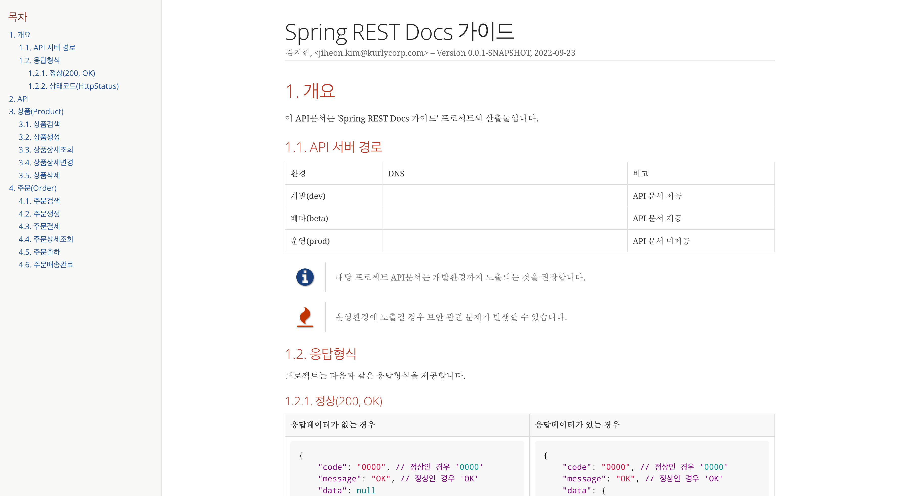
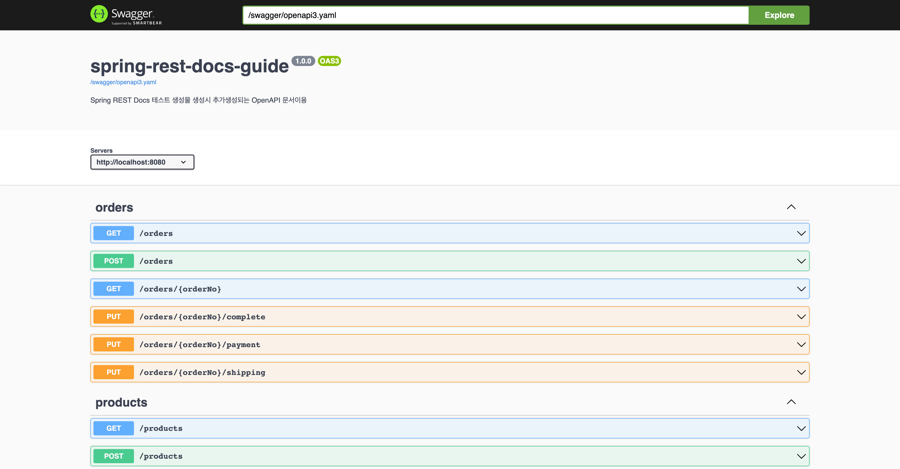
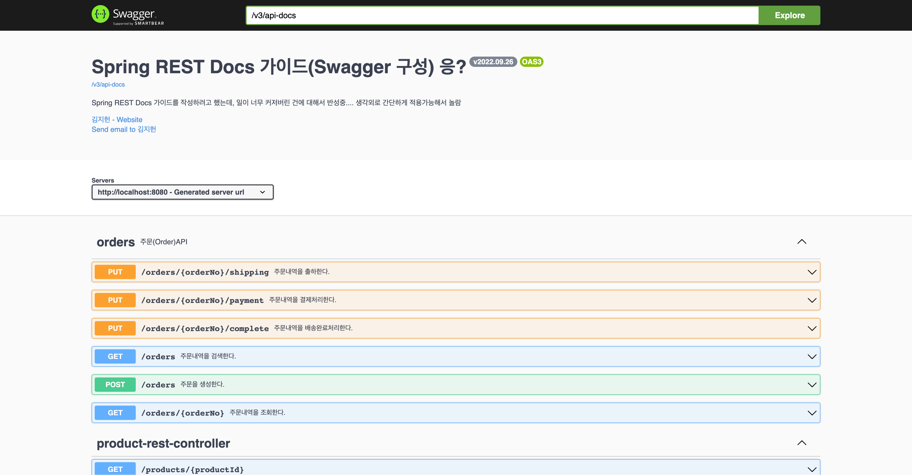

Spring Rest Docs 사용 가이드
==================================
<!-- @see https://raw.githubusercontent.com/othneildrew/Best-README-Template/master/README.md -->
<a name="readme-top"></a>

<!-- TABLE OF CONTENTS -->
<details>
  <summary>목차(Table of Contents)</summary>
  <ol>
    <li>
      <a href="#프로젝트-소개">프로젝트 소개</a>
    <li>
      <a href="#시작하기">시작하기</a>
      <ul>
        <li><a href="#준비사항">준비사항</a></li>
        <li><a href="#설치">설치</a></li>
      </ul>
    </li>
    <li><a href="#협업방법">협업방법</a></li>
    <li><a href="#부록">부록</a></li>
  </ol>
</details>

<!-- ABOUT THE PROJECT -->
## 프로젝트 소개
'Spring REST Docs 작성 가이드'를 윟나 예제프로젝트입니다.

'Spring Boot'를 기반으로 하고 있으며 간단하게 Spring REST Docs 와 Springfox 를 활용한 API문서를 제공합니다.

<p style="text-align: right">(<a href="#readme-top">최상단 이동</a>)</p>

<!-- GETTING STARTED -->
## 시작하기

프로젝트를 로컬에서 시작하려면 다음 안내를 따라주시면 됩니다.

### 요구사항
* Java 17 이상
  * Java 설치방법: [여러 개의 JDK를 설치하고 선택해서 사용하기](https://blog.benelog.net/installing-jdk.html)  

### 설치

1. 리포지토리 복제(Clone the repo)
    ```sh
   git clone git@github.com:thefarmersfront/spring-rest-docs-guide.git
   cd spring-rest-docs-guide
    ```

2. 프로젝트 구성하기(Build project)
    ```sh
   ./gradlew clean build
    ```

3. API문서생성
    ```sh
   ./gradlew clean restDocsTest
    ```

4. 생성문서 확인
   1. Spring REST Docs: `build/docs/index.html`
   2. SwaggerUI: `api-spec/openapi3.yaml`

5. 애플리케이션 실행
```sh
./gradlew apiBuild
cd build/libs
java -jar application.jar
```

### 확인
#### Spring REST Docs
[http://localhost:8080/docs/index.html]()
> 

#### Spring REST Docs - OpenAPI Specification Integration
[http://localhost:8080/swagger/swagger-ui.html]()
> 

#### Springdoc
[http://localhost:8080/swagger-ui/index.html]()
> 


<p style="text-align: right">(<a href="#readme-top">최상단 이동</a>)</p>

<!-- APPENDIX -->
## 부록

* [여러 개의 JDK를 설치하고 선택해서 사용하기](https://blog.benelog.net/installing-jdk.html)

<!-- MARKDOWN LINKS & IMAGES -->
<!-- https://www.markdownguide.org/basic-syntax/#reference-style-links -->
[url-spring-boot]: https://spring.io/projects/spring-boot/
[url-spring-boot-ref-doc]: https://docs.spring.io/spring-boot/docs/current/reference/htmlsingle/
[url-spring-rest-docs-project]: https://spring.io/projects/spring-restdocs/
[url-spring-rest-docs-ref-doc]: https://docs.spring.io/spring-restdocs/docs/current/reference/html5/
[url-swagger-io]: https://swagger.io/
[url-swagger-ui]: https://swagger.io/tools/swagger-ui/